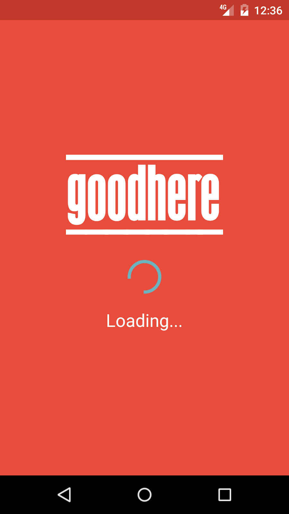
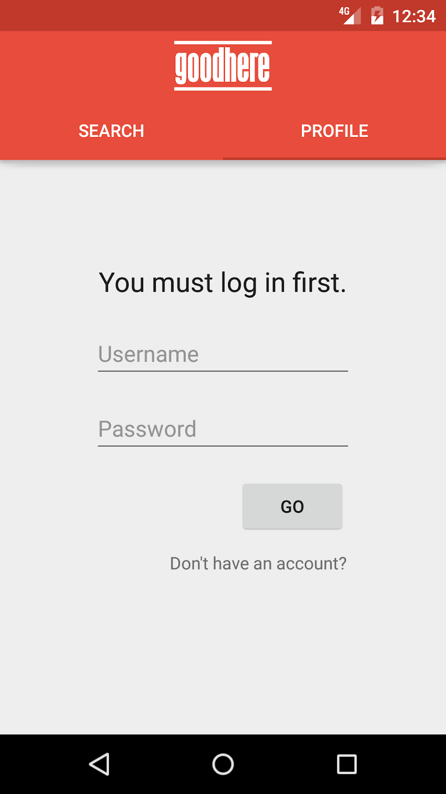
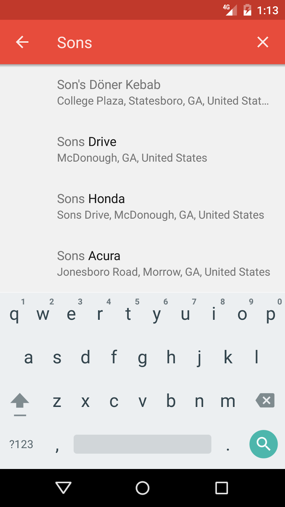
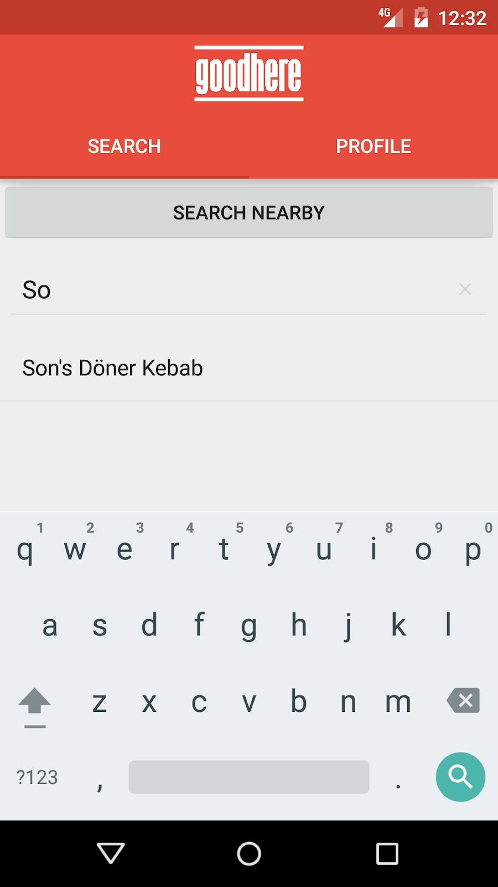
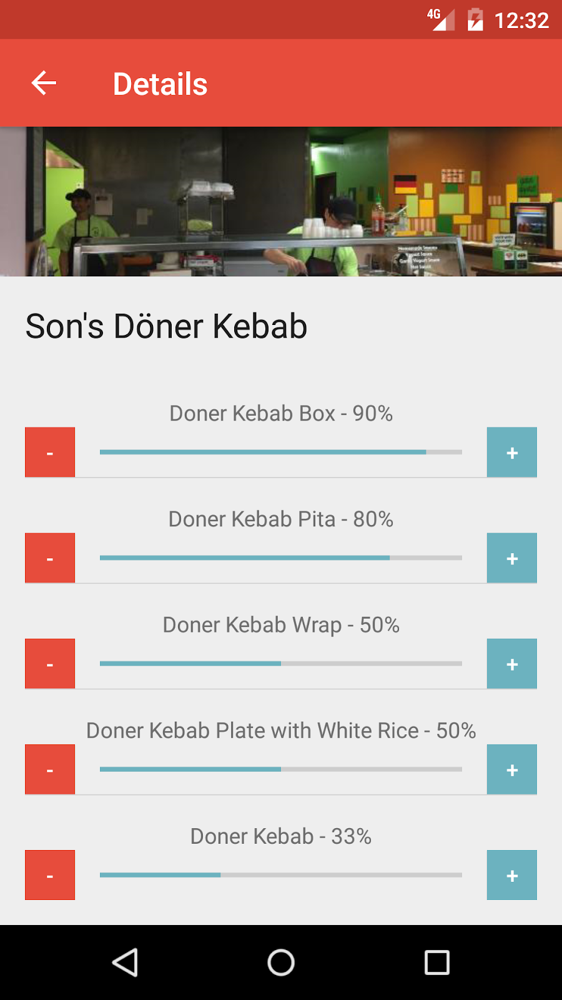

# Summary
GoodHere is a lightweight crowd-reviewing social network for individual dishes/services at businesses and establishments. Rather than rating a business as a whole, the app functions as a service to breakdown more specifically what products customers prefer based on community-sourced ratings.

Also see the [backend Django repository](#summary) (will publish soon).

Languages and frameworks used:
 - [Django](https://www.djangoproject.com/) - high-level python web framework used for management of static files and creating database models.
 - [Django Rest Framework](https://www.django-rest-framework.org/) - Django extension used to query, serialize, and deliver model information.
 - [Django OAuth Toolkit](https://github.com/jazzband/django-oauth-toolkit) - Django extension for OAuth token data via a REST API.
 - [Amazon Web Services (AWS)](https://aws.amazon.com/)
   - [Elastic Beanstalk](https://aws.amazon.com/elasticbeanstalk/) - used for scaling and deployment of GoodHere server backend.
 - [Google Places API](https://cloud.google.com/maps-platform/places/)
   - [PlacePicker](https://developers.google.com/places/android-sdk/placepicker)
 - [Google Volley](https://github.com/google/volley) - library for Android GET and POST HTTP requests.
 
### Screenshots

 
|  |  |  |
|---|---|---|
|  |  |  |
 
 